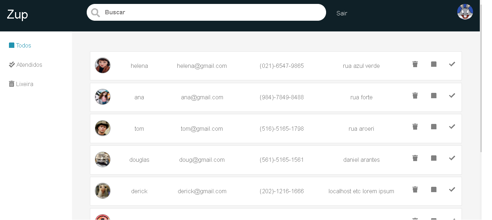

# challenge-zup

Projeto feito em php e sass e jquery junto com microframework, apache e mysql 
O projeto consite criar uma conta com informações que vão ser exibidas na busca podendo mandar o usuario para a lixieira, atendidos 
ou mesmo ver todos os usuarios cadastrados, ao clicar no usuario exibi uma tela com informações privadas

